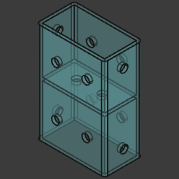
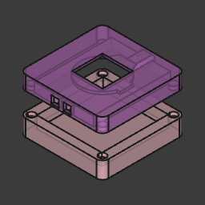
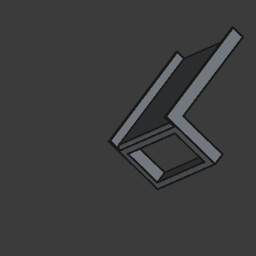
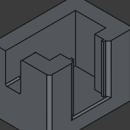

# my-freecad-files

As a beginner, I've been using FreeCAD to create and build various projects. Here are some of my files 🥰.

<!-- BEGIN TABLE -->
| Thumbnail   | File        | Description |
|-------------|-------------|-------------|
|  | [keyring-arduino.FCStd](./keyring-arduino.FCStd) | N/A |
|  | [wood-joint-attemp-01.FCStd](./wood-joint-attemp-01.FCStd) | N/A |
|  | [parametric-wood-joint.FCStd](./parametric-wood-joint.FCStd) | N/A |
|  | [angle-bracket-2.FCStd](./angle-bracket-2.FCStd) | N/A |
|  | [esp32-c3-round-display-beamsplitter-cube.FCStd](./esp32-c3-round-display-beamsplitter-cube.FCStd) | N/A |
|  | [jig.FCStd](./jig.FCStd) | N/A |
|  | [plate-motor-linear-actuator.FCStd](./plate-motor-linear-actuator.FCStd) | N/A |
|  | [angle-bracket.FCStd](./angle-bracket.FCStd) | N/A |
|  | [klamp.FCStd](./klamp.FCStd) | N/A |
|  | [keychain-esp32.FCStd](./keychain-esp32.FCStd) | N/A |
<!-- END TABLE -->
