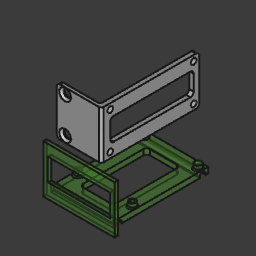
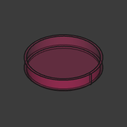
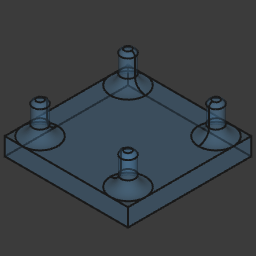
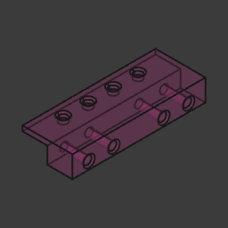
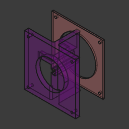
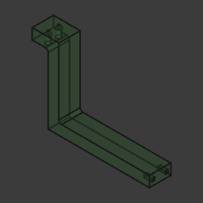
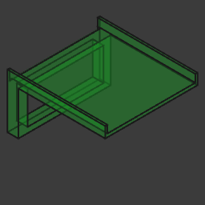
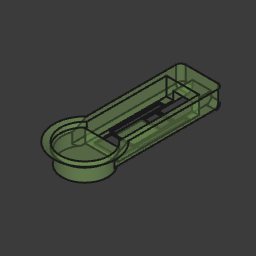
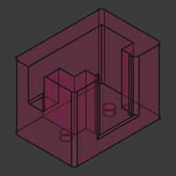

# my-freecad-files

As a beginner, I've been using FreeCAD to create and build various projects. Here are some of my files 🥰.

<!-- BEGIN TABLE -->
| Thumbnail   | File        | Description |
|-------------|-------------|-------------|
|  | [angle-bracket.FCStd](./angle-bracket.FCStd) | N/A |
|  | [rack-1u-inox-bar.FCStd](./rack-1u-inox-bar.FCStd) | N/A |
|  | [round-adapter-dry-fit-fabric.FCStd](./round-adapter-dry-fit-fabric.FCStd) | N/A |
|  | [bottom-protoboard.FCStd](./bottom-protoboard.FCStd) | N/A |
|  | [roundcable0.FCStd](./roundcable0.FCStd) | N/A |
|  | [wood-joint-attemp-01.FCStd](./wood-joint-attemp-01.FCStd) | N/A |
|  | [pegboard-hook-2.FCStd](./pegboard-hook-2.FCStd) | N/A |
|  | [rack2uv2-original-no-fillet.FCStd](./rack2uv2-original-no-fillet.FCStd) | N/A |
|  | [shoe-organizer-no-holes.FCStd](./shoe-organizer-no-holes.FCStd) | N/A |
|  | [notebook-support.FCStd](./notebook-support.FCStd) | N/A |
|  | [usb-keyring-cover.FCStd](./usb-keyring-cover.FCStd) | N/A |
|  | [parametric-wood-joint.FCStd](./parametric-wood-joint.FCStd) | N/A |
|  | [note.FCStd](./note.FCStd) | N/A |
|  | [esp32-c3-round-display-beamsplitter-cube.FCStd](./esp32-c3-round-display-beamsplitter-cube.FCStd) | N/A |
|  | [rack2uv2-original-no-rounding.FCStd](./rack2uv2-original-no-rounding.FCStd) | N/A |
|  | [rack2uv2-fillet.FCStd](./rack2uv2-fillet.FCStd) | N/A |
|  | [my-new-file.FCStd](./my-new-file.FCStd) | N/A |
|  | [angle-bracket-2.FCStd](./angle-bracket-2.FCStd) | N/A |
|  | [roundcable-original.FCStd](./roundcable-original.FCStd) | N/A |
|  | [keychain-esp32.FCStd](./keychain-esp32.FCStd) | N/A |
|  | [plate-motor-linear-actuator.FCStd](./plate-motor-linear-actuator.FCStd) | N/A |
|  | [bracket-for-desktop-under-table.FCStd](./bracket-for-desktop-under-table.FCStd) | N/A |
|  | [jig-for-camera-90-tracing-pictures.FCStd](./jig-for-camera-90-tracing-pictures.FCStd) | N/A |
|  | [rack2uv2.FCStd](./rack2uv2.FCStd) | N/A |
|  | [round-screwdriver-adapter.FCStd](./round-screwdriver-adapter.FCStd) | N/A |
|  | [keyring-arduino.FCStd](./keyring-arduino.FCStd) | N/A |
|  | [atx-adapter-support-for-table-aliexpress.FCStd](./atx-adapter-support-for-table-aliexpress.FCStd) | N/A |
|  | [rack-1u-tplink-5-ports.FCStd](./rack-1u-tplink-5-ports.FCStd) | N/A |
|  | [rack.FCStd](./rack.FCStd) | N/A |
|  | [basket-pegboard.FCStd](./basket-pegboard.FCStd) | N/A |
|  | [rpi-zero-camera-holder.FCStd](./rpi-zero-camera-holder.FCStd) | N/A |
|  | [note-no-fillets.FCStd](./note-no-fillets.FCStd) | N/A |
|  | [monitor-little-support.FCStd](./monitor-little-support.FCStd) | N/A |
<!-- END TABLE -->
